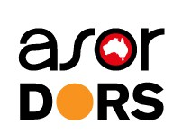

I was invited to 26th ASOR National Conference for the Australian Society of Operations Research and Defence Operations Research Symposium (ASOR/DORS) 2018. (Runner-up for best paper and presentation) 

[Check the link](https://www.confer.nz/asor-dors2018/)