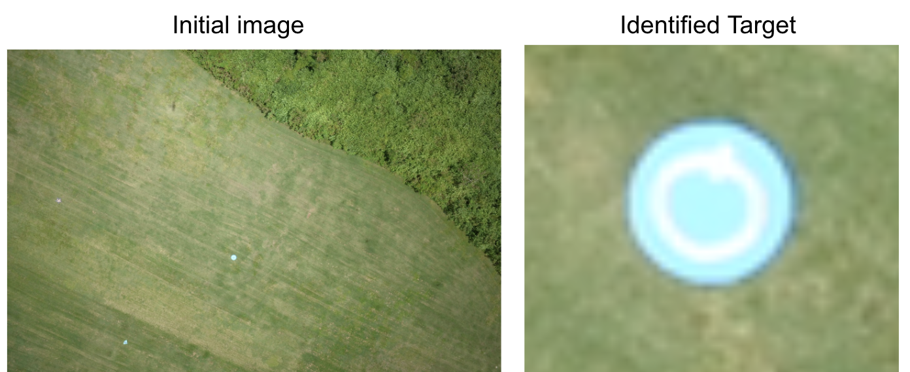

Excellence Award at the [16TH CHUNHUI CUP, Global Student Innovation And Entrepreneurship Competition](https://cyds.cscse.edu.cn/) - Because of my cooperation in the field of refrigeration, I won the Excellence Award at the 16TH CHUNHUI CUP, Global Student Innovation And Entrepreneurship Competition, (jointly organised by the [Ministry of Education of the People's Republic of China](http://en.moe.gov.cn/) and the [Ministry of Science and Technology of the People's Republic of China](http://en.most.gov.cn/), 2021.) Check for [more details](https://baike.baidu.com/item/%E6%98%A5%E6%99%96%E6%9D%AF/10413935). 