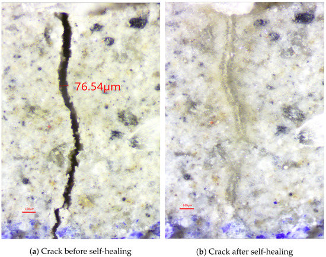

## Project Goals
Engineered cementitious composite (ECC) is a unique material, which can significantly contribute to self-healing based on ongoing hydration. However, it is difficult to model and predict the self-healing performance of ECC. Although different machine learning (ML) algorithms have been utilized to predict several properties of concrete, the application of ML on self-healing prediction is considerably rare. 

## Development
This project aims to provide a comparative analysis on the performance of various machine learning models in predicting the self-healing capability of ECC. These models include four individual methods, linear regression (LR), back-propagation neural network (BPNN), classification and regression tree (CART), and support vector regression (SVR). To improve prediction accuracy, three ensemble methods, namely bagging, AdaBoost, and stacking, were also studied. A series of experimental works on the self-healing performance of ECC samples was conducted, and the results were used to develop and compare the accuracy among the ML models. The comparison results showed that the Stack_LR model had the best predictive performance, showing the highest coefficient of determination (R2), the lowest root-mean-squared error (RMSE), and the smallest prediction error (MAE). 

## Contributions
Among all individual models studies, the BPNN model performed the best in terms of the RMSE and R2, while SVR performed the best in terms of the MAE. Furthermore, SVR had the smallest prediction error (MAE) for crack widths less than 60 μm or greater than 100 μm, while CART had the smallest prediction error (MAE) for crack widths between 60 μm and 100 μm. The study concluded that the individual and ensemble methods can be used to predict the self-healing of ECC. Ensemble models were able to improve the accuracy of prediction compared to the individual model used as their base learner, i.e., a 2.3% to 4.9% reduction in MAE. However, selecting an appropriate individual and ensemble method is critical. To improve the performance accuracy, researchers should employ different ensemble methods to compare their effectiveness with different ML models.

 [Prediction of Self-Healing of Engineered Cementitious Composite Using Machine Learning Approaches](https://www.mdpi.com/2076-3417/12/7/3605)